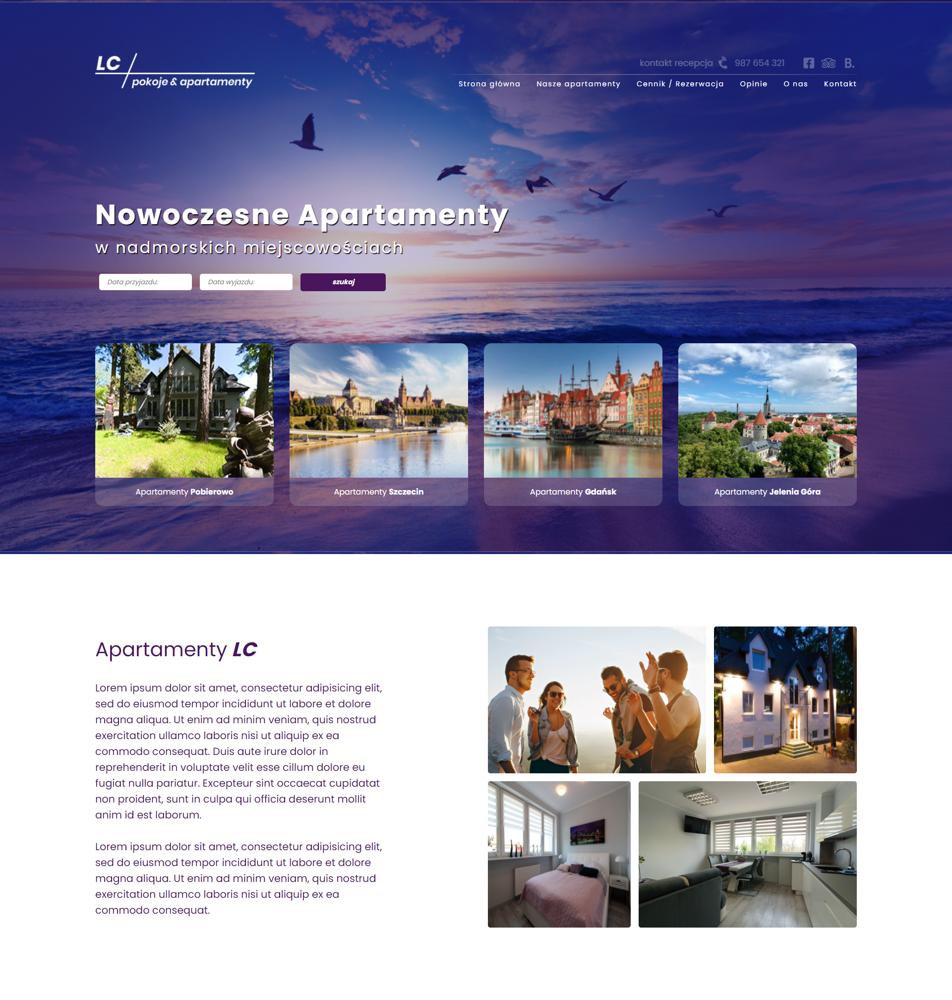

# LC | pokoje & apartamenty
Simple page based on PSD project

## Table of contents

* [Live](#live)
* [Technologies](#technologies)
* [Setup](#setup)

## Live
[LC | pokoje & apartamenty](https://kbuczynski.github.io/lc-pokoje-i-apartamenty/dist/)

## Technologies

Project is created with:

* HTML
* SCSS
* JavaScript

## Setup

To run this project in development mode, install it locally using [npm](https://www.npmjs.com):

### Available Scripts

In the project directory, you can run:

```
$ npm i
```

Installs the necessary packages

```
$ npm run scss:watch
```

Runs live SCSS compilator.

```
$ npm run build
```

Minimizes all files and save it in 'dist' folder.
